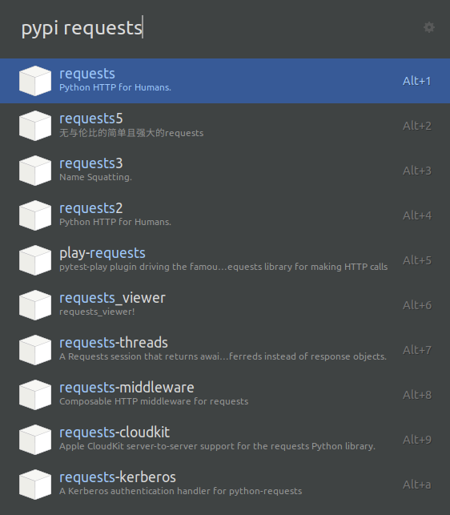

# Pypi search

> A [ulauncher](https://ulauncher.io/) Pypi search packages extension

Table of Contents
-----------------

  * [Requirements](#requirements)

Requirements
------------

This can be installed via your Linux flavor package manager or Python Pip.
Pypi search requires the following to run:

  * [requests][https://pypi.org/project/requests/]
  * [beautifulsoup4][https://pypi.org/project/beautifulsoup4/]